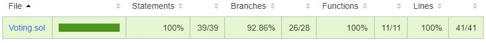

# Voting contract testing

The voting_test.js file contains all the relevant unit tests for the Voting smartcontract.

It uses openzeppelin's test-helpers library to test reverts and events.
It also uses chai library to use the expect function.

A code coverage tool is available by using the command:
```
npm run coverage
```
The result can be found in a html file in the coverage directoy.
Actual coverage:


A few problems remains on the tests while executing all of them at the same time:
- startProposalsRegistering
- startVotingSession

Executing each parts separately by using "only()" on the describe method makes the tests passing.

## Getters

### getVoter function

Before testing the function, we create a new Voting contract instance and add a voter.
We then test several cases:
- Revert when the caller is not a voter
- Get an empty value when the voter doesn't exist
- The nominal case: get a registered voter

### getOneProposal function

Before testing the function, we create a new Voting contract instance and add a voter and a proposal.
We then test several cases:
- Revert when the caller is not a voter
- Revert when on non-existent proposal
- The nominal case for description value
- The nominal case for voteCount value

## State

The 4 state functions:
- startProposalsRegistering
- endProposalsRegistering
- startVotingSession
- endVotingSession
are tested on the same basis as they work the same way.

We test:
- The change of WorkflowStatus value
- The emitted event
- The revert case (bad starting workflow status)

For the last state function "tallyVotes" we also add a test on finding the right winningProposalId.

## Proposal

### addProposal

Here we test 4 cases:
- The nominal case where a proposal is correctly added with a description
- The emitted event
- The bad workflow status revert case
- The empty proposal description revert case

## Vote

### setVote

For the setVote function, 5 cases are tested:
- The nominal case where the vote is counted and modifying the voter and the proposal adequates attributes
- The emitted event
- The bad workflow status revert case
- The revert case when a voter has already voted
- The revert case when the proposal you want to vote for doesn't exist